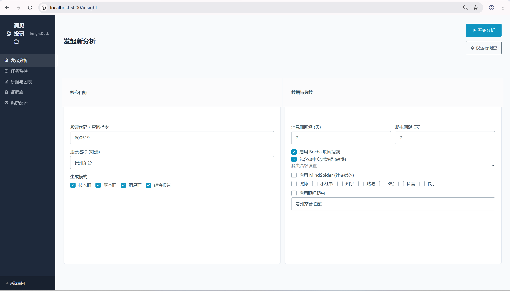

# 洞见投研室（Insight Research Room）

<div align="center">

**一个基于 AI Agent 的 A 股深度分析系统（低成本数据源 + 多 LLM 协同 + 证据库可追溯）**

[](https://www.python.org/)
[](https://github.com/guyi66/insight-research-room)
[](LICENSE)

</div>

---

## 📸 运行界面
  

---

## 📚 目录导航（TOC）

- [项目背景](#项目背景)
- [核心特性](#核心特性)
- [系统架构](#系统架构)
- [技术栈](#技术栈)
- [快速开始](#快速开始)
  - [系统要求](#系统要求)
  - [安装依赖](#安装依赖)
  - [环境检查](#环境检查)
  - [配置 .env](#配置-env)
  - [数据库初始化](#数据库初始化)
  - [子模块配置](#子模块配置)
  - [启动与使用](#启动与使用)
- [本地情感分析模型](#本地情感分析模型)
- [成本与性能参考](#成本与性能参考)
- [常见问题（FAQ）](#常见问题-faq)
- [⚠️ 安全提醒](#️-安全提醒)
- [相关链接（注册链接/控制台）](#相关链接注册链接控制台)
- [可选增强](#可选增强)

---

## 项目背景

“洞见投研室（Insight Research Room）”是一个基于 **AI Agent** 的 A 股深度分析系统：  
以 **低成本数据源（AKShare / BaoStock）** 为底座，结合 **多 LLM 协同** 与 **证据库（Evidence Base）机制**，生成 **技术面 / 基本面 / 消息面** 的结构化分析，并由 **综合 Agent** 汇总输出最终研究报告。

> 对比常见依赖付费/限流 API 的方案，本项目优先采用 AKShare / BaoStock 等低成本方案，降低长期运行与复现成本。

---

## 核心特性

- 🤖 **多智能体协同分析**
  - **Technical Agent**：技术面指标与走势解读
  - **Fundamental Agent**：基本面与财务要点解读
  - **Message Agent**：新闻/舆情/论坛热度与情绪解读
  - **Combined Agent（综合）**：三路结果对齐口径、相互印证、生成最终结论

- 🌐 **消息面补齐机制（可选）**
  - 可启用 **MindSpider 爬虫**抓取社交媒体/内容平台数据
  - 若不爬虫或数据不足，可启用 **Bocha 联网搜索**补齐与校验消息面信息

- 📈 **实时图表与导出**
  - Web 端展示 **K 线 + 多技术指标走势**
  - 报告固定四段式：**COMBINED / FUND / NEWS / TECH**
  - 支持 **导出 PDF（报告）**、**导出 CSV（分析结果与过程数据）**、**导出本次分析使用数据**

- 🧾 **证据库（Evidence Base）保证质量**
  - 每只股票、每次分析都会构建证据库：保存关键数据点、来源、中间结果与互证关系
  - 最终报告中展示“结论—证据”对应，便于复核与追溯

---

## 系统架构

### 1）模块组成

- Orchestrator：流程编排与任务调度
- Technical / Fundamental / Message：三路独立分析 Agent
- Combined：汇总与最终报告生成

### 2）数据流向图


### 3）模块关系图


---

## 技术栈

- Web：Flask、Flask-SocketIO（实时进度/状态推送）
- 数据与计算：Pandas、NumPy
- 可视化：Matplotlib（以及前端图表组件，按项目实现）
- 深度学习：PyTorch（本地情感模型推理）
- 爬虫/自动化：Playwright（MindSpider 使用）
- 其他：Requests / SQLAlchemy / Jinja2 等（按项目依赖）

---

## 快速开始

### 系统要求

- ✅ 推荐：**内存 8GB+**、**磁盘 10GB+**
- ✅ GPU：可选（本地情感模型可用 CUDA 加速；无 GPU 也能跑）
- ✅ 数据库：MySQL（推荐）或 PostgreSQL（可选，按你项目实现）

---

### 安装依赖

```bash
git clone https://github.com/guyi66/insight-research-room.git
cd insight-research-room

# 推荐：Conda
conda create -n insight_room python=3.11 -y
conda activate insight_room

pip install -r requirements.txt
```

如需启用爬虫（可选）：

```bash
playwright install
```

---

### 环境检查

```bash
python -c "import flask, torch, pandas; print('环境检查通过')"
```

---

### 配置 .env

> ⚠️ 重要：以下字段名已按“实际代码字段名”整理（请直接复制）

```env
# 端口（可选，默认 5000）
PORT=5000

# 各引擎 LLM API 配置（实际字段名）
INSIGHT_ENGINE_API_KEY=your_kimi_key
INSIGHT_ENGINE_BASE_URL=https://api.moonshot.cn/v1
INSIGHT_ENGINE_MODEL_NAME=kimi-k2-0711-preview

QUERY_ENGINE_API_KEY=your_deepseek_key
QUERY_ENGINE_BASE_URL=https://api.deepseek.com
QUERY_ENGINE_MODEL_NAME=deepseek-chat

MEDIA_ENGINE_API_KEY=your_gemini_key
MEDIA_ENGINE_BASE_URL=https://aihubmix.com/v1
MEDIA_ENGINE_MODEL_NAME=gemini-2.5-pro

REPORT_ENGINE_API_KEY=your_gemini_key
REPORT_ENGINE_BASE_URL=https://aihubmix.com/v1
REPORT_ENGINE_MODEL_NAME=gemini-2.5-pro

MINDSPIDER_API_KEY=your_deepseek_key
MINDSPIDER_BASE_URL=https://api.deepseek.com
MINDSPIDER_MODEL_NAME=deepseek-chat

FORUM_HOST_API_KEY=your_qwen_key
FORUM_HOST_BASE_URL=https://cloud.siliconflow.cn
FORUM_HOST_MODEL_NAME=qwen-plus

KEYWORD_OPTIMIZER_API_KEY=your_qwen_key
KEYWORD_OPTIMIZER_MODEL_NAME=qwen-plus

# 搜索工具（可选）
TAVILY_API_KEY=your_tavily_key
BOCHA_WEB_SEARCH_API_KEY=your_bocha_key
```

---

### 数据库初始化

> ⚠️ 需要先准备 MySQL，并创建数据库（示例：`insight_research`）

```sql
-- MySQL 中执行（示例）
CREATE DATABASE IF NOT EXISTS insight_research DEFAULT CHARSET utf8mb4;
```

然后导入两份 schema（按项目要求）：

```bash
# 方式 1：指定数据库导入（推荐）
mysql -u root -p insight_research < db/mindspider_mysql_schema.sql
mysql -u root -p insight_research < db/guba_mysql_schema.sql

# 方式 2：先进入 mysql 再 source
# mysql -u root -p
# USE insight_research;
# SOURCE db/mindspider_mysql_schema.sql;
# SOURCE db/guba_mysql_schema.sql;
```

---

### 子模块配置

> ⚠️ MindSpider 与 Guba-Crawler 需要单独配置

1) **MindSpider**：编辑 `MindSpider/config.py`  
- 配置数据库连接、平台开关、回溯窗口、API Key（如需）

2) **Guba-Crawler**：编辑 `Guba-Crawler/config.ini`  
- 配置数据库连接、抓取参数、存储选项

> 建议先不启用爬虫，使用 Bocha 搜索补齐消息面，跑通主流程后再接入爬虫。

---

### 启动与使用

启动 Web：

```bash
python app.py
```

浏览器访问：

```text
http://localhost:5000/insight
```

快速体验（推荐）：

- 在输入框中输入：`600519` 或 `贵州茅台`
- 至少勾选一个报告类型：技术面/基本面/消息面/综合报告
- 点击 **开始分析**

---

## 本地情感分析模型

> 本项目唯一的“本地模型”用于消息面热度/情绪量化：位于 `SentimentAnalysisModel/`

包含（按目录）：

- **WeiboMultilingualSentiment ⭐（主要使用）**
  - Transformers
  - 支持 22 种语言
  - 5 级情感分类：非常负面/负面/中性/正面/非常正面
  - 本地推理（PyTorch）

- WeiboSentiment_Finetuned：微博情感微调版本  
- BertTopicDetection_Finetuned：BERT 主题检测微调版本  
- WeiboSentiment_SmallQwen：轻量级 Qwen 情感分析  
- WeiboSentiment_MachineLearning：传统机器学习方法  

---

## 成本与性能参考

> 说明：成本/耗时取决于“回溯天数、是否启用爬虫/联网搜索、所选模型与输出长度”。

- ⏱️ **性能（经验值）**
  - TECH：约 **2–3 分钟**
  - NEWS：约 **5–10 分钟（含爬虫时）**
  - COMBINED：通常在三路完成后 **30–90 秒** 汇总输出

- 💰 **成本估算（建议写在这里便于新手理解）**
  - 单次完整分析通常为 **数万到十几万 tokens**（强依赖回溯窗口与消息面规模）
  - 建议月预算估算：  
    - 若每天 10 次完整分析：约 **300–3000 次/月** → 结合你所用模型单价核算  
  - 降本建议：  
    - 优先跑 TECH/FUND；NEWS 只在解释波动或事件驱动时开启  
    - NEWS 优先 Bocha 补齐，爬虫按需启用  
    - 缩短消息面回溯天数（例如 7 天 → 3 天）

---

## 常见问题（FAQ）

**Q: 点击"开始分析"报 400 错误？**  
A: 需要至少勾选一个报告类型（技术面/基本面/消息面/综合报告）

**Q: 点击"仅运行爬虫"报错 symbol required？**  
A: 必须填写股票代码输入框，即使只运行爬虫

**Q: GitHub 推送失败 Failed to connect？**  
A: 检查网络代理配置，或使用 SSH 方式推送

**Q: 情感分析模型加载失败？**  
A: 确保安装了 PyTorch 和 Transformers，可选安装 CUDA 加速

**Q: 爬虫启动失败？**  
A: 运行 `playwright install` 安装浏览器驱动

---

## ⚠️ 安全提醒

1. **永远不要将 `.env` 文件提交到 Git 仓库**
2. **不要在代码中硬编码 API 密钥**
3. **定期轮换所有 API 密钥**
4. **配置文件中的示例密钥仅供参考，生产环境必须替换**
5. **本地数据库密码可以简单，但云端部署请使用强密码**

---

## 相关链接（注册链接/控制台）

- Kimi（月之暗面）：https://platform.moonshot.cn/
- DeepSeek：https://platform.deepseek.com/
- Gemini 中转（AIHubMix）：https://aihubmix.com/
- Qwen（阿里云百炼）：https://www.aliyun.com/product/bailian
- Bocha：https://open.bochaai.com/
- Tavily：https://www.tavily.com/

---

## 可选增强


### 2）对比表（功能/成本）

| 方案 | 数据源成本 | 接入复杂度 | 消息面能力 | 可复核性（证据链） |
|---|---:|---:|---:|---:|
| 常见付费 API 方案 | 高 | 中-高 | 依赖外部接口 | 多数不强调 |
| 洞见投研室 | 低（AKShare/BaoStock） | 中 | 爬虫 + Bocha 补齐 | ✅ 强（Evidence Base） |

### 3）Docker（如未来支持）
- [ ] 增加 `docker-compose.yml`（Web + DB + 任务/队列）
- [ ] 一键启动与一键初始化脚本

---

如果你觉得项目有价值，欢迎 Star / Issue / PR。
